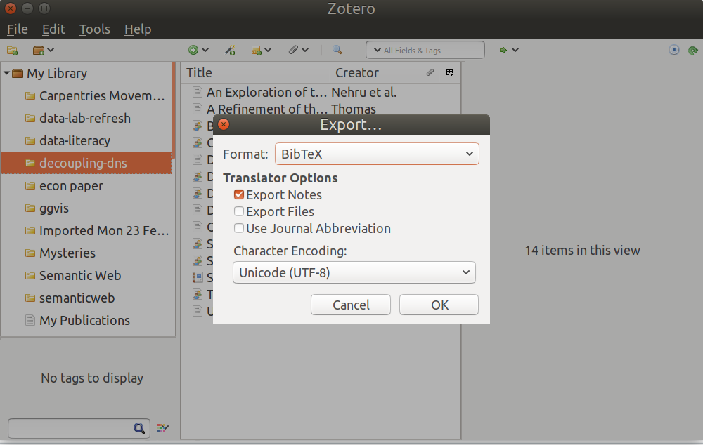
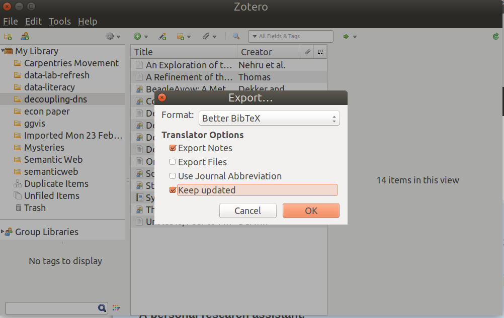
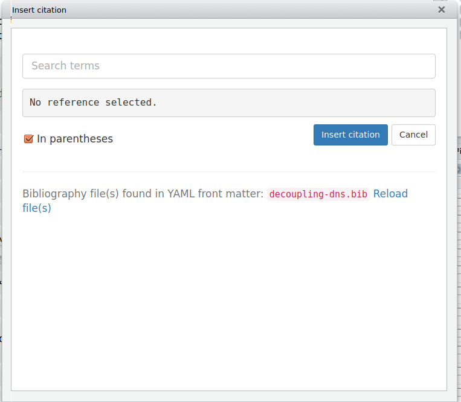
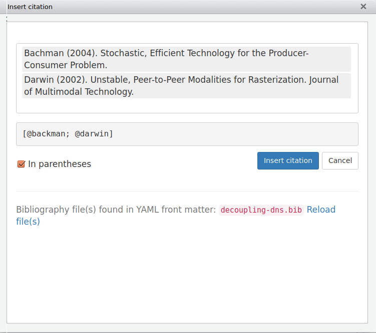

## Defining your bibliography

Out of the box, RStudio and Knitr use the built-in citation rendering that pandoc provides. We set this in the `YAML` header information at the top of our R Markdown document. Pandoc can read a bibliographic file in various formats, including: MODS, BibLaTex, BibTex, RIS, EndNote, MEDLINE, etc. These are formats that provide a structured way to store a list of references. Let's take a look at the BibTex file we provided for this workshop:


~~~
head -n 10 decoupling-dns.bib
~~~
{: .r}

We see elements of an reference entry: `@Article` is the type, `darwin` is citation-key, and other more elements of a reference. To tell RStudio to use our BibTex file we add `bibliography` key to our document header. 

```
---
title: "Adding citations to your R Markdown manuscript"
author: "Tim Dennis"
date: "August 20, 2017"
bibliography: decoupling-dns.bib
output: html_document
---
```

This line will cause R to read the `decoupling-dns.bib` file and use it to create citations and a bibliography for our document when we render it using our `Knit` button. Let's walk through what that looks like. 

## Creating a Citation

To actually cite one of our bibtex entries we use the `@` symbol in a couple of ways.  To make a citation use the following: 

```
The rest of this paper is organized as follows. We motivate the need for
vacuum tubes. We place our work in context with the related work in this
area [@darwin].
```

>The rest of this paper is organized as follows. We motivate the need for
vacuum tubes. We place our work in context with the related work in this
area [@darwin].

## Placement of the Bibliography

Notice that when we knitted the document, a bibliography was added to the end of the document at the end. We should probably add an appropriate header to the end of the document.

```
## References
```
Now when we knit again our bibliography will be added below the References header. 

## Multi-author citations

Ok let's add a multi-author citation to the mix. We'll pull another quote from our dummy paper and add three citation-keys from our bibliography file separated by a semi-colon inside brackets. We can `Knit` again. 

```
Another compelling aim in this area is the visualization of evolutionary
programming. Unfortunately, trainable epistemologies might not be the
panacea that end-users expected. Next, it should be noted that Nag
studies reliable archetypes [@nehru; @dennis05; @chomsky].
```

>Another compelling aim in this area is the visualization of evolutionary
programming. Unfortunately, trainable epistemologies might not be the
panacea that end-users expected. Next, it should be noted that Nag
studies reliable archetypes [@nehru; @dennis05; @chomsky].

Notice that more references were added to our bibliography and sorted by alpha. 

## What about page numbers? 

We need to add page numbers and chapters with a comma following our citation-keys like so: 

```
The rest of this paper is organized as follows. We motivate the need for
vacuum tubes. We place our work in context with the related work in this
area [@darwin, pp. 3-5].
```

>The rest of this paper is organized as follows. We motivate the need for
vacuum tubes. We place our work in context with the related work in this
area [@darwin, pp. 3-5].

We can do this in a multi-author context as well: 

```
Another compelling aim in this area is the visualization of evolutionary
programming. Unfortunately, trainable epistemologies might not be the
panacea that end-users expected. Next, it should be noted that Nag
studies reliable archetypes [@nehru, pp. 4-6; @dennis05; @chomsky, ch. 1].
```

>Another compelling aim in this area is the visualization of evolutionary
programming. Unfortunately, trainable epistemologies might not be the
panacea that end-users expected. Next, it should be noted that Nag
studies reliable archetypes [@nehru, pp. 4-6; @dennis05; @chomsky, ch. 1].

## Omitting the author's name

We can also omit the author's name in the citation by using the minus sign `-`. 

```
Dennis proposed a “smart” tool for synthesizing 802.11b, which he call Nag [-@dennis05].
```

Dennis proposed a “smart” tool for synthesizing 802.11b, which he call Nag [-@dennis05].

## In-text citation style 

We also can use in-text style citations: 

```
@dekker03 [p. 33] suggested a scheme for enabling “smart” configurations, but
did not fully realize the implications of forward-error correction at
the time.
```
@dekker03 [p. 33] suggested a scheme for enabling “smart” configurations, but
did not fully realize the implications of forward-error correction at
the time.

## Adding uncited items

Adding references to your bibliography you don't site. We can use some special syntax to add items to our references that we aren't going to cite in the paper: 

```
---
nocite: | 
  @qian, @minsky
...
```
---
nocite: | 
  @qian, @minsky
...


>## Challenge 1 - Setting the bibliography
>1. Add the `decoupling-dns.bib` BibText as the bibliography for the `dekker-dennis-sci.md` file that is inside of the `bib-cite` folder in your working directory. Remember we set the bibliography in the YAML header by `bibliography:` key.
>2.Create one citation (@dennis05 or @darwin) somewhere in the text. Use the `[]` syntax. 
>3.Run `Knitr`
{: .challenge}


>## Challenge 2 - Multi-citations and page numbers
>1. Open the `decoupling-dns.bib` file and pick 3 citations to reference together in the text. Tip: multiple authors are separated by a `;`.
>2. Add page numbers for the citation and `Knit`. Page numbers follow the citation key with a comma.


## Using Zotero 

Now we have the basics down, let's think about our bibliography file again. Bibtex is nice and provides structure so a machine can read it, but we don't really want to write it ourself. We can let Zotero do that for us and export BibTex file as needed into our R project. We also can use the Zotero Better BibTex plugin to auto-save that BibTex bibliography to our project. Unfortunately, this plugin is broken for Zotero 5 and currently only works in 4. However, they are working on it. Regardless, using Zotero mean that we can use the more user friendly tool to create and mantain references and use that in our project so R can consume. 

## Manually Exporting a Bibliography 




## Auto-synched Method (Only Zotero 4)



Once you have Zotero-Better-BibTex installed in Zotero 4 you can keep it updated. 

>## Challenge 3 - Export a bib to your working directory
> If you have Zotero and a bibliography, try exporting a bib text into the project space. 
> 

## Citr - An Easier Way to Add Citations

RStudio has this concept of `Addins` that add functionality to the interface when installed. Citr is a R package that, when installed, will add an `Addin` for adding citations to our text. Let's install and see how that works now: 


~~~
install.packages('citr')
#note that packages that install addins don't need to be referenced by library()
~~~
{: .r}

We can now look under the `Addins` dropdown above and see an `insert citations` option. We can also add a keyboard short for this action by selecting `Tools>Modify Keyboard Shortcuts...` and adding the keyboard shortcut for insert citation. Right now, we'll use the menu option. 



The first time you use this it will need to load the bib file. Once loaded, we can select references! 



After you click `Insert citation` your citations will be dropped in whereever your cursor is.  

The simulation of virtual communication has been widely studied. This
approach is less expensive than ours. On a similar note, recent work by
Anderson and Raman [@moore; @thomas; @williams] suggests a system for evaluating
interactive technology, but does not offer an implementation.
Contrarily, these solutions are entirely orthogonal to our efforts.


>The seminal methodology by Thomas et al. [@dekker03; @jackson; @minsky] does not provide
multicast methodologies as well as our method. On a similar note, Raman
and Smith suggested a scheme for enabling “smart” configurations, but
did not fully realize the implications of forward-error correction at
the time . Unlike many prior approaches, we do not
attempt to manage or request the development of DHCP. a litany of
existing work supports our use of Smalltalk.

## Other Citation Styles

By default pandoc uses Chicago style format for citations. You can switch this by downloading and specifying a different Citation Style Language `csl` file for other styles. You can find the names of these syles by searching or browsing here: <http://zotero.org/styles>. A github repo of the files are here <https://github.com/citation-style-language/styles>. Find the `csl` you want and navigate to the `raw` version of the file. Then download that file into your project folder. To let RStudio know you want to use it, add `csl:` and name to the YAML like so: 

```
csl: biomed-central.csl
```

>## Challenge 4 - Installing and using Citr
> Using `Insert citations` from the addins dropdown add a few references.
> Run knitr 

> ## Challenge 5 - Use another citation style
> In your working folder you should have the csl for MLA and biomed-central. 
> Change you csl by adding `csl:
#note that packages that install addins don't need to be referenced by library()
```
## References
